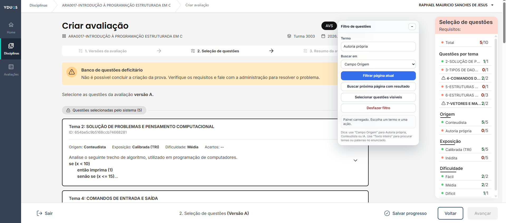
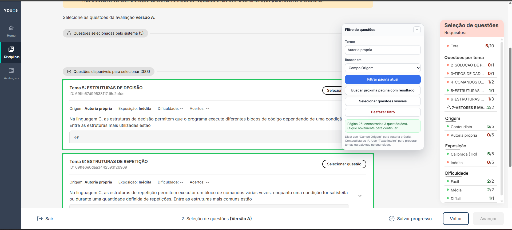
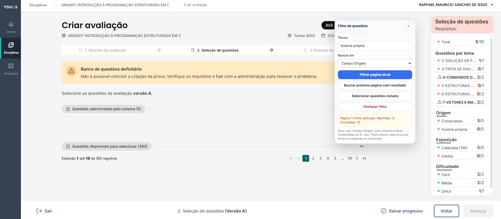
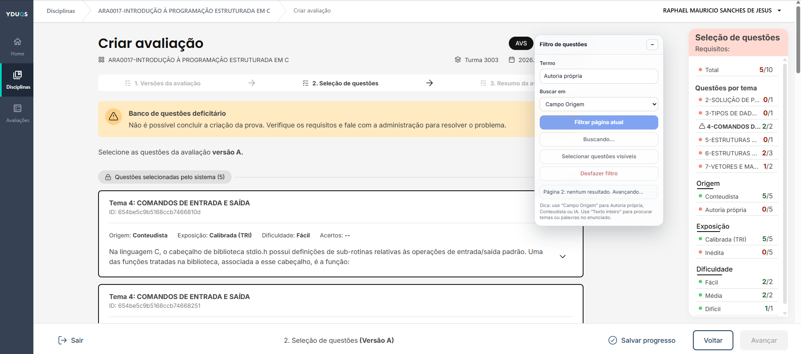
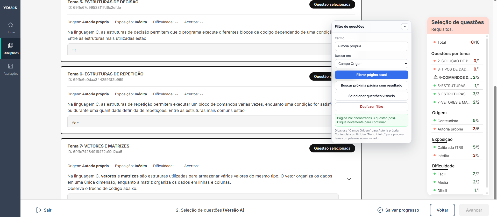
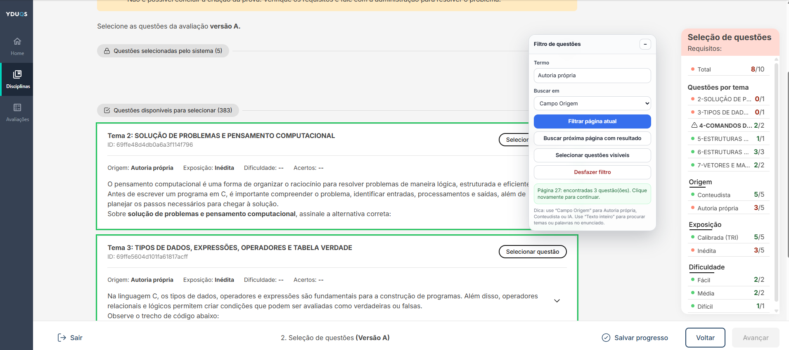

# Filtro de Questões - SAVA

Extensão Chromium para auxiliar professores na tela de seleção de questões da **Sala de Avaliações**, permitindo filtrar visualmente questões por origem ou por termos presentes no enunciado.

A extensão adiciona um painel flutuante à página de seleção de questões, permitindo localizar com mais rapidez questões de **Autoria própria**, **Conteudista**, **IA** ou qualquer outro termo desejado.

> Esta extensão é uma ferramenta auxiliar e independente. Ela não é uma extensão oficial da plataforma Sala de Avaliações.

---

## Funcionalidades

* Filtrar questões da página atual por termo.
* Buscar por termo no campo **Origem**.
* Buscar por termo no texto completo da questão.
* Localizar questões em páginas seguintes da paginação.
* Continuar a busca a partir da próxima página com resultado.
* Destacar visualmente as questões encontradas.
* Ocultar temporariamente questões que não correspondem ao filtro.
* Selecionar as questões visíveis após o filtro.
* Painel flutuante, translúcido, minimizável e arrastável.
* Botão da extensão para reiniciar o painel quando necessário.

---

## Exemplo de uso

Na tela de seleção de questões da avaliação:

1. Acesse a etapa **Seleção de questões**.
2. Aguarde o carregamento do banco de questões.
3. No painel **Filtro de questões**, informe o termo desejado.
4. Escolha onde buscar:

   * **Campo Origem**: recomendado para termos como `Autoria própria`, `Conteudista` ou `IA`.
   * **Texto inteiro da questão**: recomendado para procurar palavras no enunciado, tema ou conteúdo da questão.
5. Clique em **Filtrar página atual** ou **Buscar próxima página com resultado**.
6. Confira as questões exibidas.
7. Se desejar, clique em **Selecionar questões visíveis**.

---

## Casos de uso

### Filtrar questões de autoria própria

Use:

```text
Termo: Autoria própria
Buscar em: Campo Origem
```

Depois clique em:

```text
Filtrar página atual
```

ou:

```text
Buscar próxima página com resultado
```

---

### Procurar questões com uma palavra específica no enunciado

Use:

```text
Termo: segurança
Buscar em: Texto inteiro da questão
```

Depois clique em:

```text
Buscar próxima página com resultado
```

---

### Continuar a busca após encontrar resultados

Quando a extensão encontra questões em uma página, ela para naquela página para que o professor possa analisar os resultados.

Para continuar procurando em páginas seguintes, clique novamente em:

```text
Buscar próxima página com resultado
```

A extensão tentará avançar para a próxima página antes de buscar novamente.

---

### Screenshots













---

## Instalação local

### 1. Baixar o projeto

Clone o repositório:

```bash
git clone https://github.com/Hargenx/filtro-questoes-autoria.git
```

Entre na pasta:

```bash
cd filtro-questoes-autoria
```

---

### 2. Carregar a extensão no navegador

No Google Chrome, Microsoft Edge, Opera ou outro navegador baseado em Chromium:

1. Acesse a página de extensões:

   * Chrome: `chrome://extensions`
   * Edge: `edge://extensions`
   * Opera: `opera://extensions`
2. Ative o **Modo do desenvolvedor**.
3. Clique em **Carregar sem compactação**.
4. Selecione a pasta do projeto.
5. Acesse a página de seleção de questões da Sala de Avaliações.

---

## Estrutura do projeto

```text
filtro-questoes-autoria/
├── manifest.json
├── background.js
├── content.js
├── PRIVACY.md
├── README.MD
├── LICENSE
└── icons/
    ├── icon-16.png
    ├── icon-32.png
    ├── icon-48.png
    └── icon-128.png
└── screenshots/
    ├── img1.png
    ├── img2.png
    ├── img3.png
    └── img4.png
    ├── img5.png
    └── img6.png
```

---

## Arquivos principais

### `manifest.json`

Define as configurações da extensão, incluindo:

* Manifest V3.
* Nome e descrição.
* Ícones.
* Permissões necessárias.
* Domínio permitido.
* Script de background.
* Script de conteúdo injetado na página.

---

### `background.js`

Responsável por permitir que o usuário reinicie o painel da extensão ao clicar no ícone da extensão no navegador.

Esse recurso é útil caso a página seja recarregada parcialmente ou caso o painel precise ser reinjetado.

---

### `content.js`

Contém a lógica principal da extensão:

* Criação do painel visual.
* Filtro por termo.
* Busca na paginação.
* Identificação dos cards de questões.
* Destaque visual dos resultados.
* Ocultação temporária de itens não correspondentes.
* Seleção das questões visíveis.

---

## Permissões utilizadas

A extensão utiliza permissões mínimas para funcionar.

```json
"permissions": [
  "scripting",
  "activeTab"
]
```

### `scripting`

Usada para reinjetar o painel da extensão na página quando o usuário clica no ícone da extensão.

### `activeTab`

Permite que a extensão atue na aba ativa quando o usuário interage com o ícone da extensão.

### `host_permissions`

A extensão limita sua atuação ao domínio:

```text
https://admin.saladeavaliacoes.com.br/*
```

Ela não utiliza `<all_urls>` e não atua em sites fora do domínio necessário.

---

## Privacidade

Esta extensão não coleta dados.

Ela:

* não envia dados para servidores externos;
* não utiliza analytics;
* não armazena histórico de navegação;
* não captura credenciais;
* não altera dados diretamente em banco de dados;
* não acessa páginas fora do domínio autorizado;
* atua apenas visualmente no DOM da página carregada no navegador.

Todo o processamento ocorre localmente no navegador do usuário. Consulte [PRIVACY.md](./PRIVACY.md) para mais detalhes.

---

## Segurança

Alguns cuidados adotados no projeto:

* Permissões restritas ao domínio necessário.
* Ausência de chamadas externas.
* Ausência de `eval`.
* Ausência de bibliotecas remotas.
* Ausência de coleta de dados.
* Manipulação visual do DOM sem envio de informações.
* Criação de elementos com `document.createElement`, reduzindo riscos associados à injeção indevida de HTML dinâmico.

---

## Limitações

A extensão depende da estrutura visual atual da página da Sala de Avaliações.

Caso a plataforma altere significativamente:

* nomes dos atributos HTML;
* estrutura dos cards de questão;
* paginação;
* botões;
* textos de origem;
* organização da tela;

pode ser necessário ajustar o código da extensão.

---

## Boas práticas de uso

Recomenda-se que o professor:

* use o filtro como apoio visual;
* revise as questões antes de selecioná-las;
* utilize a seleção automática apenas após conferir os resultados;
* salve o progresso na própria plataforma;
* recarregue a página caso a plataforma apresente instabilidade.

---

## Desenvolvimento

### Requisitos

* Navegador baseado em Chromium.
* Modo desenvolvedor habilitado na página de extensões.
* Conhecimentos básicos de HTML, CSS e JavaScript para manutenção.

---

### Testar alterações

Após modificar qualquer arquivo da extensão:

1. Acesse `chrome://extensions`.
2. Clique em **Atualizar** na extensão.
3. Recarregue a página da Sala de Avaliações.
4. Teste novamente o painel.

---

## Contribuição

Contribuições são bem-vindas.

Sugestões de contribuição:

* relatar bugs;
* sugerir melhorias;
* melhorar a interface;
* revisar a documentação;
* aprimorar a detecção de cards;
* melhorar a compatibilidade com mudanças da plataforma.

Para contribuir:

1. Faça um fork do projeto.
2. Crie uma branch para sua alteração.
3. Faça os ajustes.
4. Abra um Pull Request descrevendo o que foi alterado.

---

## Aviso de responsabilidade

Esta extensão é fornecida como ferramenta auxiliar para professores.

Ela não substitui a revisão pedagógica das questões e não garante que todos os elementos da página serão identificados corretamente em caso de mudanças na plataforma.

O uso da extensão é de responsabilidade do usuário.

---

## Licença

Distribuído sob a licença MIT. Consulte [LICENSE](./LICENSE).

## Autor

Desenvolvido por **Raphael Mauricio Sanches de Jesus**.

GitHub: `@Hargenx`
